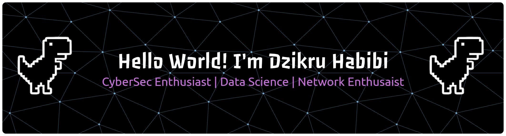

<!-- ## Hello World! I'm Dzikru Habibi 👋

 -->

## Hello World! I'm Dzikru Habibi 👋    
##### Skills   

##### Connect With Me  

##### 💻 Tech Stack:
                  

##### 📊 GitHub Stats:
<!--   -->
 

##### Play With Me

###

<picture>
  <source media="(prefers-color-scheme: dark)" srcset="https://raw.githubusercontent.com/dzhabibi05/dzhabibi05/pacman-output/pacman-contribution-graph-dark.svg">
  <source media="(prefers-color-scheme: light)" srcset="https://raw.githubusercontent.com/dzhabibi05/dzhabibi05/pacman-output/pacman-contribution-graph.svg">
  
</picture>

###

###

<!-- Proudly created with GPRM ( https://gprm.itsvg.in ) -->

<!-- ##### Skills

##### Connect With Me

 -->